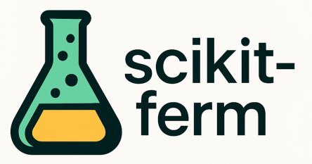

[](https://pypi.org/project/scikit-ferm/)

# scikit-ferm

**scikit-ferm** is a Python package designed to generate synthetic fermentation datasets and model microbial growth dynamics. Whether you're studying food fermentation (like yogurt production) or simulating microbial behavior for research and development, scikit-ferm provides flexible tools to create realistic datasets based on established growth models.

<a href="https://aschwins.github.io/scikit-lego/"></a>


The official documentation is hosted [here](https://aschwins.github.io/scikit-ferm/).

## Installation

Install scikit-ferm via pip with:

```bash
uv pip install scikit-ferm
```

Alternatively, to edit and contribute you can fork/clone and run:

```bash
git clone https://github.com/Aschwins/scikit-ferm.git
uv sync
```

## Features

- `skferm.datasets.generate_synthetic_growth` Generate synthetic fermentation datasets
- `skferm.growth_models.gompertz` Gompertz growth model
- `skferm.growth_models.logistic` Logistic growth model
