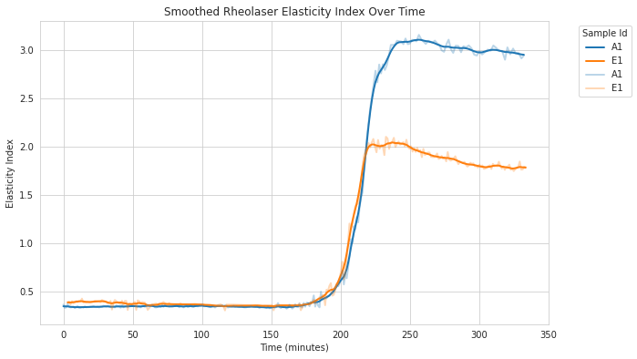

Curve Smoothing
===============

Fermentation data often contains noise that can obscure underlying biological trends. The ``skferm.smoothing`` module provides tools to reduce noise while preserving important signal characteristics.

This guide demonstrates how to smooth fermentation curves using the built-in datasets and various smoothing methods.

Overview of Smoothing Methods
-----------------------------

The ``skferm.smoothing`` module includes three main smoothing methods:

- **Rolling Mean** (``rolling``): Simple moving average over a fixed window
- **Exponential Moving Average** (``ema``): Weighted average giving more importance to recent values
- **Savitzky-Golay Filter** (``savgol``): Polynomial fitting method that preserves peaks and valleys

Basic Smoothing Example
-----------------------

Let's start with the Rheolaser dataset, which contains elasticity index measurements from fermentation experiments:

.. code-block:: python

    import matplotlib.pyplot as plt
    from skferm.datasets import load_rheolaser_data
    from skferm.plotting import plot_fermentation_curves
    from skferm.smoothing import smooth

    # Load the dataset
    rheolaser_data = load_rheolaser_data(clean=True)

    # Apply rolling mean smoothing (default method)
    smoothed_data = smooth(
        rheolaser_data,
        x="time",
        y="elasticity_index",
        groupby_col="sample_id"
    )

    # Plot the results
    fig = plot_fermentation_curves(
        smoothed_data,
        title="Smoothed Rheolaser Elasticity Index",
        x="time",
        y="elasticity_index_smooth",
        xlabel="Time (minutes)",
        ylabel="Smoothed Elasticity Index"
    )

The ``smooth()`` function automatically applies the smoothing method to each group when ``groupby_col`` is specified. It adds a new column ``elasticity_index_smooth`` with the smoothed values. It always takes the original ``y`` name and appends ``_smooth`` to create the new column name.

Available Smoothing Methods
---------------------------

You can specify different smoothing methods and their parameters:

**Rolling Mean Smoothing**

.. code-block:: python

    smoothed_data = smooth(
        rheolaser_data,
        x="time",
        y="elasticity_index",
        method="rolling",
        window_size=10,
        groupby_col="sample_id"
    )

**Exponential Moving Average**

.. code-block:: python

    smoothed_data = smooth(
        rheolaser_data,
        x="time",
        y="elasticity_index",
        method="ema",
        span=15,
        groupby_col="sample_id"
    )

**Savitzky-Golay Filter**

.. code-block:: python

    smoothed_data = smooth(
        rheolaser_data,
        x="time",
        y="elasticity_index",
        method="savgol",
        window_length=7,
        polyorder=2,
        groupby_col="sample_id"
    )

Sequential Smoothing
--------------------

For heavily noisy data, you can apply multiple smoothing methods in sequence using ``smooth_sequential()``:

.. code-block:: python

    from skferm.smoothing import smooth_sequential

    # Apply multiple smoothing stages
    smoothed_data = smooth_sequential(
        rheolaser_data,
        x="time",
        y="elasticity_index",
        groupby_col="sample_id",
        stages=[
            ("rolling", {"window_size": 2}),
            ("rolling", {"window_size": 4}),
        ]
    )

Sequential smoothing applies each method in order, with each stage operating on the output of the previous stage. For the stages parameter, provide a list of tuples where each tuple contains the method name and a dictionary of its parameters.

**Benefits of Sequential Smoothing:**

- Improved noise reduction by targeting different frequency components
- Flexibility to combine complementary smoothing approaches
- Better control over edge preservation

**Risks of Sequential Smoothing:**

- Over-smoothing can remove important signal features
- Multiple passes can introduce phase distortion
- Results become sensitive to parameter order

MTP pH Dataset Example
----------------------

The MTP pH dataset contains measurements from multiple wells across different microtiter plates:

.. code-block:: python

    from skferm.datasets import load_mtp_ph_data

    # Load MTP pH data
    mtp_ph_data = load_mtp_ph_data()

    # Select a random design for demonstration
    design_id = mtp_ph_data.design_id.sample(1).values[0]
    subset_data = mtp_ph_data[mtp_ph_data["design_id"] == design_id]

    # Apply sequential smoothing
    smoothed_mtp = smooth_sequential(
        subset_data,
        x="time",
        y="ph",
        groupby_col="sample_id",
        stages=[
            ("savgol", {"window_length": 7, "polyorder": 2}),
            ("rolling", {"window_size": 5}),
            ("rolling", {"window_size": 3}),
        ]
    )

When Smoothing Goes Wrong
-------------------------

Smoothing can introduce artifacts or remove important features if not applied carefully. Here are common problems:

**Problem 1: Curve Shifting**

Using exponential moving average followed by large rolling windows can shift curves:

.. code-block:: python

    # This combination causes unwanted curve shifting
    bad_smoothed = smooth_sequential(
        rheolaser_data,
        x="time",
        y="elasticity_index",
        groupby_col="sample_id",
        stages=[
            ("ema", {"span": 20}),      # EMA introduces lag
            ("rolling", {"window_size": 5}),  # Additional lag
        ]
    )

**Problem 2: Over-smoothing**

Too aggressive smoothing removes important biological features:

.. code-block:: python

    # Over-smoothing example
    over_smoothed = smooth(
        rheolaser_data,
        x="time",
        y="elasticity_index",
        method="rolling",
        window_size=50,  # Too large window
        groupby_col="sample_id"
    )

Evaluating Smoothing Quality
----------------------------

Always evaluate your smoothing results using both visual inspection and quantitative metrics:

.. code-block:: python

    from skferm.smoothing import evaluate_smoothing_quality

    # Calculate smoothing quality metrics
    metrics = evaluate_smoothing_quality(
        smoothed_data,
        x_col="time",
        original_col="elasticity_index",
        smoothed_col="elasticity_index_smooth",
        group_col="sample_id"
    )

    print(metrics)

The ``evaluate_smoothing_quality()`` function returns several metrics:

- **Smoothness metrics**: Total variation of original vs smoothed data
- **Fit quality**: RMSE and R² between original and smoothed curves

**Good smoothing should:**

- Reduce total variation (smoother curve)
- Maintain high R² (preserve signal shape)
- Keep RMSE low (minimal distortion)

Best Practices
--------------

1. **Always visualize results**: Plot original and smoothed data together to check for artifacts

2. **Start with gentle smoothing**: Use small window sizes first, then increase if needed

3. **Consider your data characteristics**:
   - High-frequency noise → rolling mean or Savitzky-Golay
   - Trending data → exponential moving average
   - Preserve peaks → Savitzky-Golay

4. **Use metrics to guide decisions**: Monitor total variation and fit quality

5. **Test different methods**: What works for one dataset may not work for another

6. **Be cautious with sequential smoothing**: Each additional stage increases the risk of over-smoothing

Example: Complete Workflow
--------------------------

Here's a complete example showing the recommended workflow:

.. code-block:: python

    import matplotlib.pyplot as plt
    from skferm.datasets import load_rheolaser_data
    from skferm.plotting import plot_fermentation_curves
    from skferm.smoothing import smooth, evaluate_smoothing_quality

    # 1. Load and examine data
    data = load_rheolaser_data(clean=True)

    # 2. Try gentle smoothing first
    smoothed = smooth(
        data,
        x="time",
        y="elasticity_index",
        method="rolling",
        window_size=5,
        groupby_col="sample_id"
    )

    # 3. Evaluate quality
    metrics = evaluate_smoothing_quality(
        smoothed,
        x_col="time",
        original_col="elasticity_index",
        smoothed_col="elasticity_index_smooth",
        group_col="sample_id"
    )

    # 4. Visualize results
    fig, (ax1, ax2) = plt.subplots(1, 2, figsize=(15, 6))

    # Plot subset for clarity
    subset = data[data["sample_id"].isin(["A1", "E1"])]
    smoothed_subset = smoothed[smoothed["sample_id"].isin(["A1", "E1"])]

    # Original data
    plot_fermentation_curves(
        subset, x="time", y="elasticity_index",
        title="Original Data", ax=ax1
    )

    # Smoothed data
    plot_fermentation_curves(
        smoothed_subset, x="time", y="elasticity_index_smooth",
        title="Smoothed Data", ax=ax2
    )

    plt.tight_layout()
    plt.show()

    # 5. Check metrics and adjust if needed
    print("Smoothing Quality Metrics:")
    print(metrics.describe())

This workflow ensures you apply smoothing systematically while maintaining data quality.
