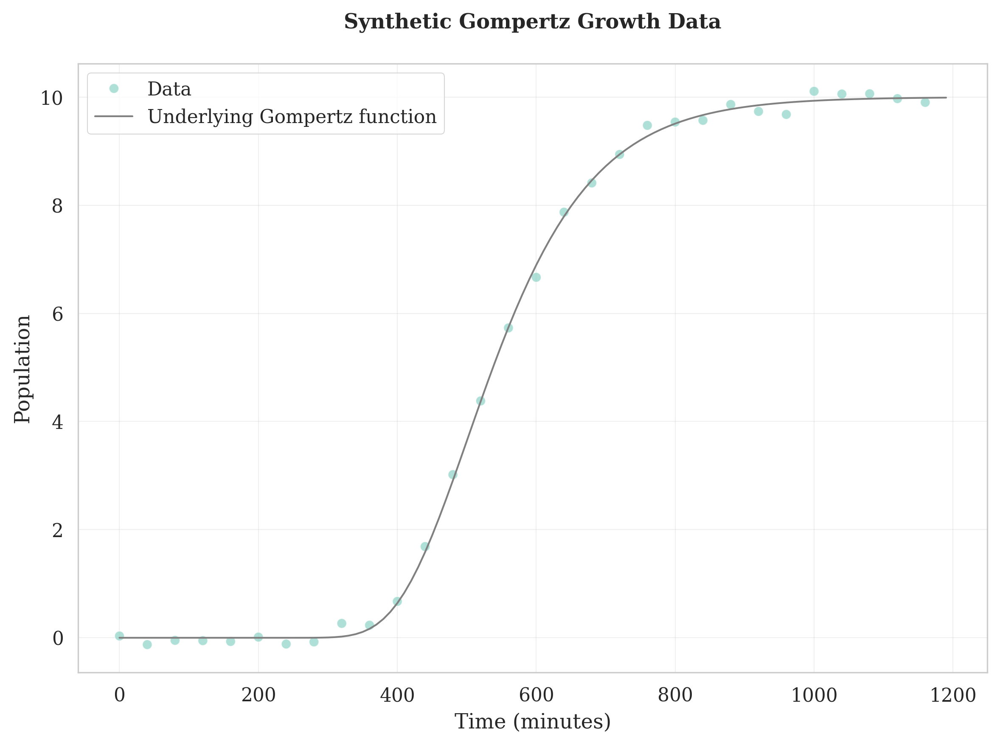

Datasets
--------

Scikit-ferm provides a datasets subpackage that includes both real experimental data and tools for generating synthetic datasets. This is useful for testing algorithms, learning how to use the package, and benchmarking different growth models.

Real Datasets
~~~~~~~~~~~~~

The package includes real experimental datasets that you can load and explore:

**Rheolaser Dataset**

The Rheolaser dataset contains elasticity index measurements over time from fermentation experiments. This data comes from a Rheolaser instrument and provides insights into the rheological properties of fermenting cultures.

.. code-block:: python

   from skferm.datasets.rheolaser import load_rheolaser_data

   # Load the raw data as it comes from the instrument
   raw_data = load_rheolaser_data(clean=False)

   # Load cleaned data in long format (recommended)
   clean_data = load_rheolaser_data(clean=True)

   # Load data with a time cutoff (e.g., first 24 hours)
   limited_data = load_rheolaser_data(clean=True, cutoff=24)

   print(clean_data.head())
   # Shows columns: sample_id, time (hours), elasticity_index

The cleaned dataset is in long format with the following columns:

* ``sample_id``: Identifier for each fermentation sample
* ``time``: Time in hours
* ``elasticity_index``: Elasticity measurement (scaled by 1000)

Synthetic Data Generation
~~~~~~~~~~~~~~~~~~~~~~~~~

For testing and experimentation, you can generate synthetic growth data using various mathematical models. Each model has different characteristics that make them suitable for different scenarios:

**Growth Model Characteristics:**

* **Logistic Growth**: S-shaped curve with symmetric growth around the inflection point. Best for simple bacterial growth in batch culture with clear carrying capacity limitations.

* **Gompertz Growth**: Asymmetric S-shaped curve with slower initial growth and growth rate peaking early. Suitable for microbial growth under environmental stress or industrial fermentation conditions.

* **Modified Gompertz Growth**: Similar to Gompertz but explicitly models lag phase duration and maximum growth rate. Preferred when lag phase is critical for analysis or when comparing fermentation startup conditions.

.. code-block:: python

   import numpy as np
   from skferm.datasets.synthetic import generate_synthetic_growth

   # Create time points
   time_points = np.linspace(0, 1200, 40)  # 20 hours, 1200/40=30 data points

   # Generate logistic growth data
   # Use when: modeling simple bacterial growth with symmetric S-curve
   logistic_data_df = generate_synthetic_growth(
       time=time_points,
       model="logistic",
       N0=0.01,          # initial population size
       r=0.015,          # growth rate
       Nmax=10,          # carrying capacity
       noise_std=.09     # add some realistic noise
   )

   # Generate Gompertz growth data
   # Use when: modeling growth with environmental stress or asymmetric patterns
   gompertz_data = generate_synthetic_growth(
       time=time_points,
       model="gompertz",
       a=10,             # upper asymptote
       b=150,            # displacement along time axis
       c=0.01,           # growth rate
       noise_std=.09     # add some realistic noise
   )

   # Generate modified Gompertz growth data
   # Use when: lag phase duration is critical for your analysis
   modified_gompertz_data = generate_synthetic_growth(
       time=time_points,
       model="modified_gompertz",
       A=10,             # upper asymptote
       L=200,            # lag phase duration
       mu=0.05,          # maximum specific growth rate
       noise_std=.09     # add some realistic noise
   )
